# AutoTraderBot Proje Analizi ve Akış Diyagramı

Tarih: 2026-05-02

Bu rapor, `C:\Users\eness\Downloads\AutoTraderBot\AutoTraderBot` klasöründe yapılan statik incelemeye dayanır. Canlı exchange, API veya gerçek emir yolu çalıştırılmadı.

## Kapsam

Gözlenen toplam dosya sayısı: `116276`.

Dosyalar üç sınıfta ele alındı:

- Proje kaynakları ve operasyon dosyaları: `64337`
- Cache/metaveri: `5047`
- `.venv` bağımlılık ortamı: `46892`

Kaynak kod analizi için generated/cache/bağımlılık dizinleri ayrı tutuldu. Derin kaynak okumasında dışlanan sınıflar: `.venv`, `__pycache__`, `.pytest_cache`, `.mypy_cache`, `.ruff_cache`, `.hypothesis`, `.claude`, `.pytest_local_tmp`, `frontend/node_modules`, `frontend/dist`.

Bu filtreyle okunan Python kaynak dosyası: `1032`. Tümü `utf-8-sig` ile AST seviyesinde ayrıştırıldı, parse hatası yok.

Önemli dosya grupları:

| Alan | Dosya sayısı | Rol |
| --- | ---: | --- |
| kök Python dosyaları | 92 | legacy girişler, analiz, kalibrasyon, updater, yardımcı servisler |
| `runtime/` | 31 | resmi boot, startup, loop, servis orkestrasyonu |
| `core/` | 56 | ana motor, execution router, order executor, sözleşmeler |
| `decision/` | 75 | skor, pipeline, risk modeli, strateji uzmanları |
| `analysis/` | 28 | teknik analiz, microstructure, sentiment, regime girdileri |
| `ml/` | 76 | dataset, transformer, RL, training, registry, drift |
| `execution/` | 16 | güvenli emir wrapper, audit, funding, SOR, trade logger |
| `risk/` | 21 | kill switch, cooldown, sizing, margin, portfolio guard |
| `exchanges/` | 9 | OKX/Binance/Bybit/Bitget adaptörleri |
| `api/` | 25 | FastAPI, auth, dashboard, positions, trades, metrics |
| `frontend/src` | 49 | React operator console |
| `tests/` | 346 | unit, integration, e2e, audit doğrulamaları |
| `tools/` | 119 | kalite, smoke, audit, migration ve release araçları |
| `docs/` | 58 | mimari, runbook, operasyon ve eğitim dokümanları |
| `data/models/metrics/reports/logs/state/secrets` | 1739 | runtime artefaktları, modeller, loglar, durum ve secret dosyaları |

## Üst Düzey Sistem Özeti

AutoTraderBot tek bir bot scripti değil, risk-first çalışan modüler bir trading ve operasyon platformudur.

Ana zincir:

1. Runtime boot edilir.
2. Config, secret, risk default ve startup policy doğrulanır.
3. Exchange bağlantısı kurulur.
4. Startup reconciliation ile pozisyon durumu güvenilir mi kontrol edilir.
5. Core engine sembol evrenini seçer.
6. Market verisi, teknik analiz, sentiment, regime ve microstructure girdileri toplanır.
7. Decision pipeline teknik skor, LLM/AI, RL/ML, regime ve postprocess gate'lerini birleştirir.
8. Execution katmanı confidence, timing, no-trade, risk multiplier, portfolio guard, edge contract ve data quality kontrollerinden geçirir.
9. Router emir tipini, büyük emir parçalamayı, SL/TP korumasını ve exchange-specific parametreleri belirler.
10. Order executor dry-run, shadow veya gerçek exchange yoluna gider.
11. Sonuç state, audit, metrics, trade log, dashboard ve WebSocket tarafına yansır.

## Çok Kapsamlı Akış Diyagramı

```mermaid
flowchart TD
    U["Operator / CLI / Scheduler"] --> CLI["autotraderbot/cli.py"]
    U --> RTMOD["python -m runtime"]
    U --> APISTART["uvicorn api.main:app"]
    U --> FEDEV["frontend npm run dev/build"]

    CLI --> STACK["runtime/project_stack.py"]
    CLI --> RTMAIN["runtime/__main__.py"]
    RTMOD --> RTEP["runtime/entrypoint.py"]
    RTEP --> MAINENTRY["runtime/main_entry.py"]
    RTMAIN --> RTEP
    STACK --> API["api/main.py"]
    STACK --> RTEP

    MAINENTRY --> UTF8["stdout UTF-8 + CLI env overrides"]
    MAINENTRY --> MEMGUARD["memory_guardian.py"]
    MAINENTRY --> CFGLOAD["core/config_loader.py + config.json"]
    MAINENTRY --> ENV["settings.py + secret_env.py + .env"]
    MAINENTRY --> RISKDEF["runtime/risk_defaults.py"]
    MAINENTRY --> STARTVALID["runtime/startup_validation.py"]
    MAINENTRY --> LOCK["runtime instance lock"]
    MAINENTRY --> MODE["api/runtime_mode.py + execution mode snapshot"]

    CFGLOAD --> HARDEN["core/product_hardening.py"]
    CFGLOAD --> RISKCFG["config/risk_defaults.json + risk config"]
    ENV --> SECRETS["secrets/ + secrets.enc + env vars"]
    RISKDEF --> FAILSAFE["strict risk defaults / fail closed"]
    STARTVALID --> BOOTOK{"startup valid?"}
    BOOTOK -- "no" --> STOPBOOT["abort before trading"]
    BOOTOK -- "yes" --> STARTSERV["optional startup services"]

    STARTSERV --> CONFRELOAD["config_reloader"]
    STARTSERV --> SCHED["scheduler_thread"]
    STARTSERV --> SENTISCHED["sentiment_scheduler.py"]
    STARTSERV --> STOPWATCH["stop_order_watchdog.py"]
    STARTSERV --> HEALTH["health_monitor.py"]
    STARTSERV --> TRAIN["ml/scheduled_training.py"]
    STARTSERV --> HEDGE["spot_hedge.py"]
    STARTSERV --> PROM["prometheus_exporter.py"]
    STARTSERV --> TG["telegram_notifier.py + notifier/"]
    STARTSERV --> EVENTSUB["core/event_bus.py subscribers"]
    STARTSERV --> DASHLISTEN["runtime/dashboard_command_listener.py"]
    STARTSERV --> MACRO["analysis/macro_sensor.py"]
    STARTSERV --> SYSWD["sys_watchdog.py"]

    STARTSERV --> EXINIT["runtime/main_bot_impl.initialize_exchange_async"]
    EXINIT --> EXFACT["exchanges/factory.py"]
    EXFACT --> OKX["exchanges/okx.py"]
    EXFACT --> BINANCE["exchanges/binance.py"]
    EXFACT --> BYBIT["exchanges/bybit.py"]
    EXFACT --> BITGET["exchanges/bitget.py"]
    OKX --> CCXT["ccxt async REST / optional ccxt.pro WS"]
    BINANCE --> CCXT
    BYBIT --> CCXT
    BITGET --> CCXT

    EXINIT --> DRYRUN["core/service_container.resolve_execution_dry_run"]
    EXINIT --> RECON["runtime/position_reconciliation.py startup gate"]
    RECON --> TRUST{"exchange/account state reliable?"}
    TRUST -- "no" --> STOPBOOT
    TRUST -- "yes" --> ENGINECREATE["core/engine/bot.create_engine"]

    ENGINECREATE --> ENGINE["core/engine/bot.BotEngine"]
    ENGINE --> SYMBOLS["core/engine/symbols.py"]
    ENGINE --> LIFECYCLE["core/engine/lifecycle.py"]
    ENGINE --> DASHENG["core/engine/dashboard.py"]
    ENGINE --> TELEMETRY["core/engine/telemetry.py"]
    ENGINE --> ANALYSIS["core/engine/analysis.py"]
    ENGINE --> EXECENG["core/engine/execution.py"]

    SYMBOLS --> SYMBOLSRC["config trade_parameters / OKX swap discovery / dynamic selector"]
    LIFECYCLE --> LOADMARKETS["exchange.load_markets"]
    DASHENG --> EVENTBUS["core/event_bus.py"]
    TELEMETRY --> STATUS["runtime_status.py + state_manager.py + metrics"]

    ENGINE --> LOOP["_main_loop"]
    LOOP --> CYCLE["_run_analysis_cycle"]
    CYCLE --> ANABATCH["core/engine/analysis_batch.py"]
    ANABATCH --> ANALYZEONE["runtime/runtime_analysis_services._analyze_one"]
    ANALYZEONE --> OHLCV["exchange.fetch_ohlcv / ticker / orderbook / trades"]
    ANALYZEONE --> TA["analysis/* indicators, MTF, regime, microstructure"]
    TA --> TPACK["runtime/runtime_ta_pack.py"]
    TA --> MARKETMET["market_metrics.py"]
    TA --> ORDERBOOK["orderbook_analyzer.py + analysis/orderbook_analyzer.py"]
    TA --> SENTIMENT["sentiment.py + social_scanner.py + analysis/sentiment.py"]
    TA --> ONCHAIN["onchain_analytics.py + onchain_data_updater.py"]
    TA --> LIQ["liquidation_data_provider.py + whale_alert_provider.py"]
    TA --> MACRODATA["macro_data_updater.py + macro_filter.py"]
    ANABATCH --> DATAQUALITY["anomaly_detector.py + stale/volume guards"]
    ANABATCH --> BATCHITEMS["DecisionInput-like batch items"]

    BATCHITEMS --> ENRICH["analysis_execution.feed_microstructure"]
    ENRICH --> MICRO["analysis/microstructure.py"]
    BATCHITEMS --> DECPIPE["core/decision_pipeline.py"]
    DECPIPE --> CTRL["controller_async.decide_batch"]
    CTRL --> AISVC["ai_batch_manager.py + ai_batch_services.py"]
    AISVC --> LLM["chatgpt_client.py + ai/deepseek_runtime.py + ai/provider_runtime.py"]
    CTRL --> OFFICIAL["decision/official_pipeline.py"]
    OFFICIAL --> BASESCORE["decision/score_calculator.py"]
    BASESCORE --> TECH["decision/tech_score.py + analysis/technical_voting.py"]
    BASESCORE --> SENT["decision/sent_score.py"]
    BASESCORE --> RL["decision/rl_integration.py + ml/rl_*"]
    BASESCORE --> AIFUSION["ai/fusion/* + decision/score_sources/*"]
    OFFICIAL --> REGIME["decision/regime_manager.py + regime_detector.py + analysis/regime.py"]
    OFFICIAL --> EXPERTS["decision/strategy_experts/* + strategy_router.py"]
    OFFICIAL --> EDGE["decision/edge_gate.py + edge_memory.py"]
    OFFICIAL --> QUALITY["trade_quality_gate.py + quality_gate/*"]
    OFFICIAL --> POST["decision/score_sources/postprocess.py + risk_components/*"]
    OFFICIAL --> DUAL["pipeline_v2 dual-write + execution/decision_audit.py"]
    POST --> DECISION["DecisionResult / decision dict"]

    DECISION --> EXECSERVICE["core/engine/analysis_execution.execute_decisions"]
    EXECSERVICE --> NOTRADE["ml/no_trade_filter.py"]
    EXECSERVICE --> TIMING["timing_filters.py + execution/timing.py + entry_optimizer.py"]
    EXECSERVICE --> RISKALL["risk/manager.py UnifiedRiskManager"]
    RISKALL --> KILL["risk/kill_switch.py"]
    RISKALL --> DAILY["risk/daily_limits.py + daily_risk_budget.py"]
    RISKALL --> COOL["risk/cooldowns.py"]
    RISKALL --> MARGIN["risk/margin_health.py"]
    RISKALL --> PSIZE["risk/position_sizer.py + drawdown_position_sizer.py"]
    RISKALL --> PORTGUARD["risk/portfolio_guard.py + core/sector_rotation.py"]
    EXECSERVICE --> FUNDING["execution/funding_aware.py"]
    EXECSERVICE --> CROSS["cross_asset_signals.py + pair_trading.py"]
    EXECSERVICE --> SHADOWPRE["core/shadow_executor.py pre-dispatch skips"]

    EXECSERVICE --> SIZE["core/engine/execution.compute_order_size"]
    SIZE --> BALANCE["core/exchange_contract.get_balance_usdt"]
    SIZE --> MARKETRULES["core/market_notional.py + exchange market precision"]
    SIZE --> ROUTER["core/execution_router.py"]

    ROUTER --> DQGATE["data-quality gate"]
    ROUTER --> EDGEGATE["edge contract gate"]
    ROUTER --> PROTECT["fallback SL/TP + fee-adjusted TP"]
    ROUTER --> SPLIT{"notional large?"}
    SPLIT -- "yes" --> TWAP["TWAP/VWAP/iceberg slicing"]
    SPLIT -- "no" --> ORDERTYPE["market vs limit selection"]
    ORDERTYPE --> ROUTEREQ["core/order_executor.OrderRequest"]
    TWAP --> ROUTEREQ

    ROUTEREQ --> EXECUTOR["core/order_executor.OrderExecutor"]
    EXECUTOR --> SHADOW{"settings.SHADOW_MODE?"}
    SHADOW -- "yes" --> SHADOWEXEC["core/shadow_executor.py"]
    SHADOW -- "no" --> DRY{"dry_run?"}
    DRY -- "yes" --> DRYSIM["paper-style simulated fill + slippage/fees"]
    DRY -- "no" --> LIVEGUARD["core/live_safety.py"]
    LIVEGUARD --> BINBLOCK["Binance disabled/protection guard"]
    LIVEGUARD --> PROTERR["live entry protection required"]
    LIVEGUARD --> HEALTHBLOCK["runtime health + reconnect + circuit breaker"]
    HEALTHBLOCK --> IDEM["core/idempotency.py"]
    IDEM --> LIVEORDER["_execute_live_request"]
    LIVEORDER --> SETLEV["set leverage with cap"]
    LIVEORDER --> PARAMS["core/order_placement.py + order_protection.py"]
    PARAMS --> CREATE["exchange.create_order/create_orders"]
    CREATE --> FILL["core/order_reconciliation.py fill extraction"]
    FILL --> PARTIAL["partial-fill handling + cancel remainder"]
    PARTIAL --> PROTAUDIT["exchange-side protection audit"]
    PROTAUDIT -- "missing protection" --> FAILCLOSE["fail-safe close/cancel"]
    PROTAUDIT -- "ok" --> ORDERRESULT["core/models.OrderResult"]

    ORDERRESULT --> TRADELOG["execution/trade_logger.py + signal_logger.py"]
    ORDERRESULT --> AUDIT["execution/decision_audit.py"]
    ORDERRESULT --> STATE["state_manager.py + state/*.json"]
    ORDERRESULT --> METRICS["metrics_manager.py + metrics/*.json/jsonl"]
    ORDERRESULT --> REPORTS["reports/ + records/ + logs/"]
    ORDERRESULT --> DASHAPI["api/services/dashboard_service.py"]

    API --> AUTH["api/auth.py + rate_limit.py + CSRF guard"]
    API --> ROUTES["api/routes/*"]
    ROUTES --> POS["positions/trades/metrics/config/bot_control/dashboard/brain/websocket"]
    AUTH --> DASHAPI
    DASHAPI --> SNAPSHOT["dashboard snapshot + control center"]
    SNAPSHOT --> WS["/ws/updates broadcast"]
    API --> STATIC["frontend/dist mounted when built"]
    STATIC --> REACT["frontend/src/App.tsx"]
    REACT --> HOOK["frontend/src/dashboard/useDashboardRuntimeCore.ts"]
    HOOK --> FETCH["REST polling + WebSocket live snapshot"]
    HOOK --> COMMANDS["manual_order / close_position / reload_config / config save"]
    COMMANDS --> OPSGUARD["api/ops_guard.py + dashboard command queue"]
    OPSGUARD --> QUEUE["metrics/dashboard_commands.json"]
    QUEUE --> DASHLISTEN
    DASHLISTEN --> EVENTBUS
    EVENTBUS --> ENGINE

    TRAIN --> MLTRAIN["ml/build_dataset.py + transformer_train.py + rl_train.py"]
    MLTRAIN --> DATASET["data/*.npz/parquet + data/feature_meta.json"]
    MLTRAIN --> MODELS["models/*.pt/*.zip/*.pkl"]
    MLTRAIN --> VALMET["metrics/validation/*.json"]
    MODELS --> MLLOAD["ml/model_loader.py + model_registry.py"]
    MLLOAD --> RL
    VALMET --> MONITOR["model_performance_monitor.py + ml/drift_monitor.py"]
    MONITOR --> HEALTH

    TOOLS["tools/* quality, smoke, release, audit"] --> TESTS["tests/*"]
    TESTS --> PYTEST["python -m pytest -q"]
    TESTS --> FRONTTEST["frontend npm test/build/smoke"]
    PYTEST --> QUALITYB["quality_budget.json + coverage.xml"]
    FRONTTEST --> STATIC
```

## Katman Katman Dosya Rolü

### 1. Giriş ve yaşam döngüsü

- `autotraderbot/cli.py`: `stack`, `runtime`, `api` alt komutlarını sağlar.
- `runtime/entrypoint.py`: resmi bot-only boot komutunun ön kapısıdır.
- `runtime/main_entry.py`: risk default validasyonu, startup config validasyonu, tek runtime lock, optional servisler, exchange init, startup reconciliation ve core engine başlatma işlerini yapar.
- `runtime/main_bot_impl.py`: legacy runtime uyumluluğu ve bazı halen kullanılan hesaplama/yordamlar: exchange init, TP/SL tamamlama, sizing helper, scheduler helper.
- `runtime/runtime_main_service.py` ve `runtime/runtime_loop_services.py`: eski/servis tabanlı runtime yolunda dashboard command handler, WebSocket, arbitrage, DCA, continuous learning, seçenek/liquidation/whale monitor ve ana trading loop servislerini taşır.

### 2. Ana motor

- `core/engine/bot.py`: BotEngine sınıfı; symbol, dashboard, execution, lifecycle, telemetry ve analysis servislerini birleştirir.
- `core/engine/symbols.py`: sembol evreni, normalize etme, exchange market uyumluluğu.
- `core/engine/analysis_batch.py`: her döngüde sembolleri analiz için toplar, timeout ve stale/volume/anomaly kontrollerini yapar.
- `core/engine/analysis_pipeline.py`: `DecisionPipeline` ile controller/official pipeline kararlarını alır.
- `core/engine/analysis_execution.py`: kararları execution öncesi timing, no-trade, risk, funding, macro, cross-asset ve final confidence gate'lerinden geçirir.
- `core/engine/execution.py`: bakiye, kullanılabilir bakiye, order budget, market precision ve nihai size hesaplar.

### 3. Karar sistemi

- `core/decision_pipeline.py`: motor ile `controller_async.decide_batch` arasındaki tipli facade.
- `controller_async.py`: batch decision servisini kurar; AI batch, risk models, calibration, weights, RL ve official pipeline bağımlılıklarını bağlar.
- `decision/official_pipeline.py`: tek sembol için stage sırası: input, base scores, AI fusion, LLM stage, risk gate, final decision, dual-write, audit.
- `decision/score_calculator.py` ve `_score_calculator_static.py`: skor hesaplama uyumluluk modülleri.
- `decision/tech_score.py`, `decision/sent_score.py`, `decision/rl_integration.py`: teknik, sentiment ve RL skor kaynakları.
- `decision/strategy_experts/*`: bull trend, bear trend, range revert, compression breakout ve transition confirmation uzmanları.
- `decision/edge_gate.py`, `decision/edge_memory.py`: edge contract ve geçmiş performans koşulları.
- `decision/risk_components/*` ve `decision/risk_models.py`: decision seviyesinde risk state/policy/finalize yükleri.

### 4. Analiz ve veri girdileri

- `analysis/*`: MTF, market structure, microstructure, orderbook, volume profile, VPIN, wavelet, Hurst, Kalman, sentiment, macro, spoofing, iceberg, OI/delta divergence gibi sinyal üretir.
- `market_metrics.py`, `orderbook_analyzer.py`, `liquidation_data_provider.py`, `whale_alert_provider.py`, `ops_data_provider.py`: market mikro/makro ve dış veri besleyicileri.
- `data/*`: historical downloader, parquet storage, rate limiter, risk dataset/schedule/calibration/optimizer ve social sentiment updater.

### 5. ML/AI

- `ai/*`: batch LLM cache/logging/orchestration, provider runtime, DeepSeek runtime, RL agent, transformer ve fusion scorer.
- `ai_batch_manager.py` ve `ai_batch_services.py`: LLM batch karar servisleri ve fallback davranışları.
- `chatgpt_client.py`, `chatgpt_decision_layer.py`, `llm_cache.py`: OpenAI/LLM istemcisi, karar katmanı, cache.
- `ml/build_dataset.py`: supervised dataset üretimi.
- `ml/transformer_train.py`, `ml/transformer_inference.py`, `ml/transformer_model.py`: transformer eğitim ve inference.
- `ml/rl_train.py`, `ml/rl_runtime.py`, `ml/rl_predict.py`, `ml/rl_unified_manager.py`, `ml/rl_env*.py`: RL eğitim ve runtime tüketimi.
- `ml/model_registry.py`, `ml/model_loader.py`, `ml/model_deployer.py`, `model_performance_monitor.py`: model lifecycle, registry, deployment ve performans izleme.
- `ml/drift_monitor.py`, `ml/live_drift_monitor.py`, `ml/concept_drift.py`, `ml/online_learning.py`: drift ve online learning.

### 6. Risk ve güvenlik

- `risk/manager.py`: unified risk coordinator; kill switch, daily limits, cooldown, margin health, portfolio guard ve sizing'i tek kararda toplar.
- `risk/kill_switch.py`: multi-level durdurma.
- `risk/daily_limits.py`, `risk/daily_risk_budget.py`: günlük kayıp ve risk bütçesi.
- `risk/cooldowns.py`: symbol/global cooldown.
- `risk/margin_health.py`: liquidation distance ve margin health.
- `risk/portfolio_guard.py`: pozisyon sayısı, korelasyon, sector ve portfolio risk.
- `risk/position_sizer.py`, `risk/drawdown_position_sizer.py`, `risk/streak_adapter.py`: size adaptasyonu.
- `core/live_safety.py`: live execution için capital isolation, watchdog ve exchange-side protection guardları.
- `trade_quality_gate.py` ve `quality_gate/*`: event calendar, pre-trade quality checks ve güvenlik gate'leri.

### 7. Emir ve exchange

- `core/execution_router.py`: data quality, edge contract, fallback SL/TP, fee-adjusted TP, TWAP/VWAP, market/limit seçimi ve executor çağrısı.
- `core/order_executor.py`: shadow/dry-run/live ayrımı, live safety, idempotency, leverage cap, exchange params, create_order, fill reconciliation, partial fill, protection audit, fail-safe close/cancel.
- `execution/safe_order_wrapper.py`: legacy güvenli emir wrapper ve OKX algo/protection yardımcıları.
- `execution/trade_logger.py`: trade lifecycle kayıtları.
- `execution/decision_audit.py`: karar ve trade audit trail.
- `execution/exchange_resilience.py`: exchange failure/circuit sinyalleri.
- `exchanges/base.py`: adaptör sözleşmesi, reconnect state, symbol normalization ve ccxt helperları.
- `exchanges/okx.py`, `binance.py`, `bybit.py`, `bitget.py`: exchange implementasyonları.
- `paper_trading/*`: internal paper exchange, order simulator, virtual account/position, persistence ve runner.

### 8. API ve frontend

- `api/main.py`: FastAPI app, lifespan, auth, CSRF guard, rate limit, router mount, dashboard WebSocket broadcast.
- `api/routes/*`: positions, trades, config, bot control, metrics, dashboard, brain, websocket.
- `api/services/dashboard_service.py`: operator console için snapshot üretir.
- `frontend/src/App.tsx`: sayfa routing.
- `frontend/src/dashboard/useDashboardRuntimeCore.ts`: REST polling, WebSocket, config save, artifact save, manual order, close position, reload command akışları.
- `frontend/src/dashboard/*`: cockpit shell, navigation, status ribbon, control/hardening/operator views ve validation.

### 9. Artefaktlar, dokümantasyon ve test

- `config/*.json`, `config.json`, `.env.example`, `.env.production.example`: runtime ve deploy konfigürasyonu.
- `.env`, `.env.local`, `secrets.enc`, `secrets/*`: secret/kullanıcı ortamı. İçerik rapora alınmadı.
- `data/`, `models/`, `metrics/`, `records/`, `reports/`, `state/`, `logs/`: model, veri, runtime state ve gözlem artefaktları.
- `docs/*`: mimari, API, runtime lifecycle, risk policy, runbook, deployment, training ve operational boundary dokümanları.
- `tests/*`: geniş unit/integration/e2e doğrulama matrisi.
- `tools/*`: release gate, smoke, audit, static quality, health ve migration araçları.

## Kritik Çalışma Modları

Gözlenen default eğilim:

- `config.json` içinde OKX sandbox aktif.
- `paper_trading.enabled` false.
- `live_safety.enabled` true.
- `live_readiness` demo/live geçişini şartlara bağlıyor.
- `product_hardening` scheduled training, portfolio optimization ve legacy fallback gibi kabiliyetleri defaultta sınırlandırıyor.

Bu, projenin varsayılan olarak canlı emir açmaya değil, demo/testnet/dry-run güvenliğine yakın tasarlandığını gösterir. Canlı emir riski olan dosyalar özellikle `core/order_executor.py`, `core/live_safety.py`, `execution/safe_order_wrapper.py`, `runtime/main_entry.py`, `api/routes/dashboard.py`, `frontend/src/dashboard/useDashboardRuntimeCore.ts` ve `runtime/dashboard_command_listener.py` çevresindedir.

## Kontrol ve Veri Geri Besleme Akışı

1. React operator console `/api/dashboard/bootstrap` ve ilgili endpointlerden snapshot alır.
2. WebSocket `/ws/updates` dashboard/status/alert yayınlarını taşır.
3. Kullanıcı config kaydı, reload, close position veya manual order aksiyonu yaparsa frontend önce Zod validation yapar.
4. API auth, CSRF, rate limit ve ops guard uygular.
5. Dashboard command queue `metrics/dashboard_commands.json` üzerinden runtime listener'a gider.
6. Runtime listener event bus'a yazar.
7. BotEngine/dashboard service veya legacy runtime handler aksiyonu işler.
8. Sonuç audit trail, metrics, queue ve snapshot üzerinden UI'ye geri döner.

## Risk Odaklı Gözlemler

- Sistem live order öncesi birden fazla fail-closed katmanı kullanıyor: startup validation, reconciliation gate, live safety, protection audit, idempotency, circuit breaker, runtime health block.
- Entry kararı sadece skorla açılmıyor; timing, no-trade, data quality, edge contract, confidence threshold, risk multiplier, position sizing, market precision ve portfolio guard sonrasında router'a gidiyor.
- `OrderExecutor` dry-run ve shadow yolunu gerçek execution yolundan açık biçimde ayırıyor.
- Exchange-side protection eksikse fail-safe close/cancel yolu var.
- Buna rağmen runtime iki mimari hattı taşıyor: yeni `core.engine.bot` ve legacy `runtime.main_bot_impl`/`runtime_loop_services`. Bu esneklik uyumluluk sağlıyor, fakat analiz ve bakım maliyetini artırıyor.

## Doğrulama

Yapılan kontroller:

- Toplam dosya sayımı alındı: `116276`.
- `.venv`, cache, local tmp ve frontend bağımlılıkları ayrı sınıflandırıldı.
- Generated/bağımlılık dışı Python kaynak sayısı alındı: `1032`.
- `1032` Python dosyasının tamamı `utf-8-sig` ile AST parse edildi; parse hatası yok.
- Ana giriş ve çalışma zinciri dosyaları doğrudan okundu: `runtime/entrypoint.py`, `runtime/main_entry.py`, `runtime/main_bot_impl.py`, `runtime/runtime_main_service.py`, `runtime/runtime_loop_services.py`, `core/engine/bot.py`, `core/engine/analysis*.py`, `core/engine/execution.py`, `core/decision_pipeline.py`, `controller_async.py`, `decision/official_pipeline.py`, `core/execution_router.py`, `core/order_executor.py`, `risk/manager.py`, `exchanges/*`, `api/main.py`, `api/routes/dashboard.py`, `frontend/src/App.tsx`, `frontend/src/dashboard/useDashboardRuntimeCore.ts`.
- Frontend kaynak listesi `frontend/node_modules` ve `frontend/dist` dışında çıkarıldı.
- Dokümantasyon, config, observability, data/model/metrics/log/state artefakt grupları sayım/rol düzeyinde incelendi.

Çalıştırılmayan kontroller:

- `pytest`, frontend testleri, runtime smoke veya canlı/dry-run startup çalıştırılmadı.
- Exchange API çağrısı yapılmadı.
- Gerçek emir, paper emir veya simüle emir gönderilmedi.

## Sınırlar ve Belirsizlikler

- `.venv`, `frontend/node_modules`, cache ve `.pytest_local_tmp` içindeki dosyalar proje bağımlılığı/çıktısı olarak sınıflandırıldı; tek tek kaynak semantiği çıkarılmadı.
- `.env`, `.env.local`, `secrets.enc` ve `secrets/*` içerikleri güvenlik nedeniyle rapora alınmadı.
- Log, model, parquet, sqlite, zip, pt, pkl gibi artefaktlar dosya grubu ve runtime rolü düzeyinde değerlendirildi; içerik bazlı model performans iddiası yapılmadı.
- Bu rapor statik analizdir. Profitability, drawdown, live readiness veya production safety iddiası değildir.
