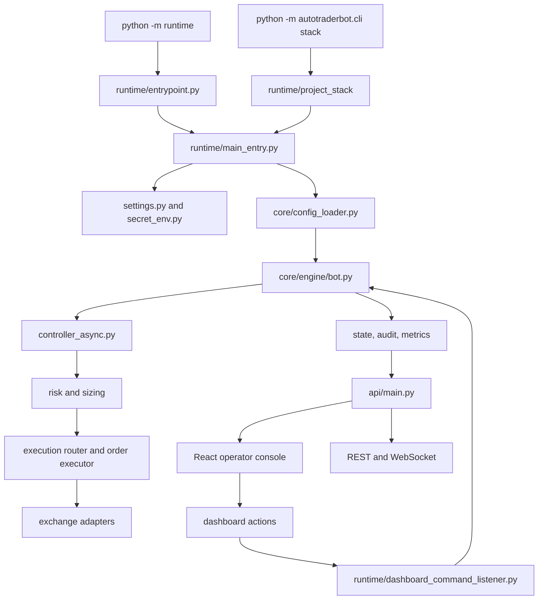

# AutoTraderBot

AutoTraderBot, kripto perpetual futures odakli moduler bir trading ve operasyon platformudur.
Bu repo tek bir bot scripti degildir; su katmanlar birlikte calisir:

- runtime orchestration
- exchange entegrasyonu
- teknik analiz ve karar motoru
- risk, sizing ve execution
- ML ve LLM destekli skorlamalar
- FastAPI backend
- React operator console
- Streamlit diagnostics console
- audit, metrics ve control-plane altyapisi

Bu repo hem bot runtime'ini hem de operator, diagnostics ve deployment yuzeylerini birlikte tasir.

AutoTraderBot'un dogru konumu: self-hosted, safety-first, paper/shadow kanitli crypto trading automation platformu.
Bu proje 3Commas benzeri hosted retail UX urunu degildir; live calisma ancak operator attestation, demo soak, shadow validation ve risk gate kanitlariyla acilabilir.

## Icerik

- [Ilk 30 Saniye](#ilk-30-saniye)
- [Amac](#amac)
- [Ne Var, Ne Yok](#ne-var-ne-yok)
- [Ust Duzey Mimari](#ust-duzey-mimari)
- [Calisma Profilleri](#calisma-profilleri)
- [Mevcut Varsayilan Durum](#mevcut-varsayilan-durum)
- [Gereksinimler](#gereksinimler)
- [Hizli Baslangic](#hizli-baslangic)
- [Runtime Veri Konumu](#runtime-veri-konumu)
- [Tam Refresh: Veri, Egitim ve Full Startup](#tam-refresh-veri-egitim-ve-full-startup)
- [Runtime ve UI Baslatma Yollari](#runtime-ve-ui-baslatma-yollari)
- [Test ve Dogrulama](#test-ve-dogrulama)
- [Runtime Servisleri](#runtime-servisleri)
- [Dashboard Yetkinlikleri](#dashboard-yetkinlikleri)
- [ML ve Model Artefactlari](#ml-ve-model-artefactlari)
- [Konfigurasyon Alanlari](#konfigurasyon-alanlari)
- [Proje Dizinleri](#proje-dizinleri)
- [Guvenlik ve Operasyon Notlari](#guvenlik-ve-operasyon-notlari)
- [Sorun Giderme](#sorun-giderme)
- [Dokumantasyon Haritasi](#dokumantasyon-haritasi)

## Ilk 30 Saniye

Yeni bir makinede veya yeni bir kopyada once bu sirayi kullan:

```cmd
python -m autotraderbot.cli doctor
python -m autotraderbot.cli setup --dry-run
python -m autotraderbot.cli runtime
```

Bu akista:

- `doctor` config, secret scan, runtime artifact ozeti ve non-destructive live-readiness raporu uretir.
- `setup --dry-run` `reports/pre_cleanup_baseline_YYYYMMDD.json` ve `reports/workspace_migration_manifest_YYYYMMDD.json` yazar; varsayilan olarak dosya tasimaz.
- `runtime` resmi bot runtime'ini baslatir.
- Ilk calistirma live degildir; real-money emir gonderimi live-readiness gate'leri gecmeden aktif kabul edilmez.

Full stack operator konsolu icin:

```cmd
python -m autotraderbot.cli stack --safe
```

`--safe` paper/dry-run/testnet ortamini zorlar ve live credential etkisini ilk bring-up sirasinda dislar.

## Amac

Projenin temel amaci su zinciri uretmektir:

1. market verisini topla
2. teknik, sentiment, AI ve regime sinyallerini birlestir
3. risk ve sizing kurallarini uygula
4. emri uygun execution yoluna gonder
5. sonucu state, log, metrics ve dashboard tarafina yansit
6. operatorun sistemi izlemesine, audit etmesine ve yonetmesine izin ver

## Ne Var, Ne Yok

Bu repo icin "calisiyor" ifadesi su anlama gelir:

- runtime acilir
- secilen moda gore exchange auth gecerli olur
- API ve dashboard ayaga kalkar
- runtime servisleri config'e gore yuklenir
- test ve smoke zinciri temizdir
- gerekli model ve veri artefactlari okunabilir durumdadir

Bu ifade "repodaki her satir kod ayni anda aktif" anlamina gelmez.
Bazi moduller kosulludur ve ancak belirli senaryolarda devreye girer:

- `SmartExitManager`: acik pozisyon varsa
- `meta_stacking`: yeterli kapanmis trade gecmisi varsa
- conformal / online calibration: yeterli trade sayisindan sonra
- live execution: ancak live credential ve live mode ile
- scheduled training: hardening engeli kaldirilirsa
- portfolio optimization: experimental blok kaldirilirsa

## Ust Duzey Mimari

Ana giris noktalar:

1. [runtime/entrypoint.py](runtime/entrypoint.py)
   Resmi runtime boot path. Onerilen bot-only komut: `python -m runtime`
2. [runtime/main_entry.py](runtime/main_entry.py)
   Runtime bootstrap, startup policy, servis secimi ve core engine baslatma
3. [autotraderbot/cli.py](autotraderbot/cli.py)
   Bot + API + build alinmis frontend icin resmi full-stack launcher: `python -m autotraderbot.cli stack`
4. [core/engine/bot.py](core/engine/bot.py)
   Ana runtime trading loop
5. [controller_async.py](controller_async.py)
   Teknik, AI, sentiment, regime ve calibration karar katmani
6. [core/order_executor.py](core/order_executor.py) ve [execution/safe_order_wrapper.py](execution/safe_order_wrapper.py)
   Order execution ve korumali emir yolu
7. [api/main.py](api/main.py)
   FastAPI backend, auth, REST, websocket ve frontend mount
8. [frontend](frontend)
   React operator console
9. [dashboard_streamlit.py](dashboard_streamlit.py)
   Diagnostics-only Streamlit yuzeyi



## Calisma Profilleri

Pratikte 4 temel profil vardir:

| Profil | Ana kullanim | Emir yolu |
| --- | --- | --- |
| Demo / testnet | Onerilen ilk bring-up | Gercek exchange demo/testnet |
| Internal paper | Simulasyon | Ic paper engine |
| Live | Gercek operasyon | Gercek exchange live |
| Dry-run / diagnostics | Yazilim dogrulama | Emir gondermez |

### Demo / testnet

En guvenli ilk bring-up budur.
Exchange entegrasyonu, execution zinciri ve runtime servisleri gorulur; gercek para riski yoktur.

### Internal paper

`paper_trading.enabled=true` ile ic paper engine kullanilir.
Bu, exchange demo modundan farklidir.

### Live

Live icin su kombinasyon gerekir:

- `config.json` icinde `sandbox=false`
- `.env` veya secret kaynagi icinde gecerli `OKX_LIVE_API_*`
- dry-run kapali
- operator risk ve auth ayarlari dogru

### Dry-run / diagnostics

Smoke, startup ve emirsiz dogrulama icin uygundur.
Gercek emir beklememek gerekir.

## Mevcut Varsayilan Durum

Repo'nun bugunku varsayilan konfigurasyonunda:

- `okx.sandbox = true`
- `paper_trading.enabled = false`
- `scheduled_training.enabled = false`
- `runtime.services.scheduled_training = false`
- `exchanges.okx.max_leverage = 25`
- `risk.max_leverage = 25`
- `leverage_policy.max_entry_leverage = 25`
- `pipeline_v2.learning_probe_mode.max_leverage = 1`
- `live_safety.canary.max_leverage = 1`
- `disabled_models = []`
- `hybrid_weights = chatgpt 0.3, deepseek 0.3, transformer 0.3, ppo_rl 0.1`
- `product_hardening.enabled = true`
- `product_hardening.blocked_capabilities = portfolio_optimization, legacy_runtime_fallback`

Bunun pratik anlami:

- varsayilan yol demo / paper benzeri guvenli moddur
- scheduled training default startup zincirinin parcasidir, ancak live auto-deploy kapali tutulur
- portfolio optimization varsayilan olarak experimental ve frozen durumdadir
- resmi engine order size'i `wallet_allocation_pct`, `default_order_usdt`, bakiye, decision allocation ve contract marketlerde decision leverage cap'leriyle hesaplar
- ChatGPT ve DeepSeek devrededir; transformer ve PPO/RL ancak dogrulanmis artifact dosyalari mevcut ve yukleme basariliysa `hybrid_weights` oranlariyla ensemble'a katilir
- `pipeline_v2.learning_probe_mode.max_leverage = 1` paper/testnet ogrenme sirasinda bilincli bir korumadir; ana runtime cap 25x olsa bile probe trade'leri 1x ile sinirlanir
- `live_safety.canary.max_leverage = 1` ayri bir live gecis korumasidir; ilk canary donemi bitmeden live leverage'i ana cap'e tasimaz
- EWC ve online model update esigi `feature_window_trades_since_update >= 100` kosuluyla tetiklenir; `trades_since_update` model update esigi degildir
- legacy open trade kayitlarinda `online_feature_window` yoksa bu kapanislar online learning model update'ine katilmaz; sentetik feature uretilmez

## Gereksinimler

Asgari gereksinimler:

- Python >=3.12
- pip
- Node.js 20+ ve npm
- Windows, Linux veya WSL

Bu repo icin fiili hedef surum Python `3.12` ve uzeridir.
Bu makinede standart calisma komutu `python ...` olarak verilmelidir.
Nedeni, Python `3.12` kurulu olsa bile Windows `py` launcher her makinede kurulu olmayabilir.

Pratik kural:

- Python surum standardi: `3.12`
- Bu makinede onerilen komut standardi: `python`
- `py -3.12` ancak Windows Python Launcher kuruluysa kullanilabilir

Ana Python bagimliliklari [requirements.txt](requirements.txt) icindedir.
Frontend bagimliliklari [frontend/package.json](frontend/package.json) icindedir.

## Hizli Baslangic

Bu bolum sifirdan demo / testnet full-stack startup icindir.
Egitim artefactlarini bastan uretmek istemiyorsan bu yol yeterlidir.

### 1. Repo kokune gec

```cmd
cd /d C:\Users\eness\Downloads\AutoTraderBot\AutoTraderBot
```

### 2. Sanal ortami kur ve ac

```cmd
python -m venv .venv
call .venv\Scripts\activate
```

### 3. Python bagimliliklarini kur

```cmd
python -m pip install --upgrade pip
pip install -r requirements.txt
```

### 4. Frontend bagimliliklarini kur ve build al

```cmd
cd frontend
npm install
npm run build
cd ..
```

### 5. Environment sec

Demo / testnet icin:

```cmd
set ALLOW_DOTENV_FALLBACK=1
set APP_ENV_FILE=.env
set OKX_USE_TESTNET=1
set WRAPPER_DRY_RUN=0
```

Yerel `.env` kullanmak istemiyorsan process env veya secret mount tercih edilmelidir.

### 6. Pre-flight kontrolleri calistir

```cmd
python -m autotraderbot.cli doctor
python -m autotraderbot.cli setup --dry-run
python tools/health/verify_startup.py
python tools\runtime_cli_smoke.py
```

### 7. Full-stack baslat

```cmd
python -m autotraderbot.cli stack
```

Bu yol bot runtime, API ve build alinmis frontend'i birlikte ayaga kaldirir.

Ilk lokal denemede live credential etkisini tamamen dislamak icin guvenli mod da kullanilabilir:

```cmd
python -m autotraderbot.cli stack --safe
```

## Runtime Veri Konumu

Bu repo kaynak agaci ile runtime artefact alanini ayri tutar.
[runtime_paths.py](runtime_paths.py) su sirayla runtime kokunu secer:

1. `ATB_RUNTIME_ROOT` tanimliysa o dizin kullanilir.
2. `TESTING=1` ise `.pytest_local_tmp/runtime` kullanilir.
3. Aksi halde Windows'ta `%LOCALAPPDATA%\AutoTraderBot\AutoTraderBot\runtime` kullanilir.

Canonical runtime dizinleri:

- `<runtime>/metrics`
- `<runtime>/data`
- `<runtime>/models`
- `<runtime>/logs`
- `<runtime>/state`

Proje kokundeki `metrics/`, `data/` ve `models/` dizinleri legacy/fallback veya repo icindeki ornek artefactlar icin kalabilir.
Guncel veri cekme, dataset build ve model egitim komutlari normalde `<runtime>` altina yazar.

Izole deneme icin:

```cmd
set ATB_RUNTIME_ROOT=C:\tmp\autotraderbot-runtime
```

## Tam Refresh: Veri, Egitim ve Full Startup

Bu bolum "her sey sifirdan yenilensin" akisi icindir.
Veri cekme, supervised dataset, transformer, LightGBM, RL ve sonrasinda full startup zincirini kapsar.

Kritik not:
Bu repoda farkli scriptlerin varsayilan `window` degerleri farklidir.
Tutarlilik icin ayni `window` degeri elle verilmelidir.
Onerilen standart `window=60`, `horizon=12`, `pred_gap=5`'tir.

Dataset performans notu:
`ml.build_dataset` once tum OHLC JSON dosyasini okur, sonra 5m base timeline uzerine MTF feature'lari merge eder.
`--limit` global satir limiti degil, sembol/timeframe basina tail limitidir.
Buyuk OHLC dosyalarinda JSON okuma, MTF merge, parquet/NPZ yazimi ve compression halen dakikalar alabilir.
`--auto-threshold` artik supervised `X` pencerelerini her threshold adayi icin tekrar tekrar uretmez; pencere matrisi threshold secildikten sonra tek kez uretilir.

### 1. Ham OHLC verisini uret

```cmd
python generate_ohlc_bulk.py --limit 5000
```

Ana cikti:

- `<runtime>/metrics/ohlc_history.json`
- `<runtime>/metrics/ohlc_coverage_report.json`

Mevcut runtime dosyasi yeni veriden cok daha buyukse script buyuk dosyayi korur ve partial cikti yazabilir.
Bilerek ezmek icin `--force` gerekir.

### 2. Supervised dataset olustur

Kontrollu lokal build:

```cmd
python -m ml.build_dataset --window 60 --horizon 12 --pred_gap 5 --limit 3000 --auto-threshold --no_undersample
```

Tum runtime gecmisini daha genis kullanmak istiyorsan `--limit` degerini buyut veya default `10000` degerini kullan:

```cmd
python -m ml.build_dataset --window 60 --horizon 12 --pred_gap 5 --auto-threshold --no_undersample
```

Ana ciktilar:

- `<runtime>/data/supervised_w60_h12_g5.npz`
- `<runtime>/data/supervised_w60_h12_g5.parquet`
- `<runtime>/data/feature_meta.json`

### 3. Transformer egitimi

```cmd
python -m ml.transformer_train --window 60 --epochs 100
```

Ana ciktilar:

- `<runtime>/models/transformer_candidate.pt`
- `<runtime>/models/transformer_latest.pt` (yalniz acceptance gecerse publish edilir)
- `<runtime>/models/transformer_best.pt` (yalniz acceptance gecerse publish edilir)
- `<runtime>/metrics/validation/transformer_validation_summary.json`
- `<runtime>/metrics/validation/transformer_candidate_validation_summary.json`

Kabul kriteri:

- egitimin bitmesi yetmez
- `transformer_validation_summary.json` icinde `acceptance_passed: true` olmalidir
- baseline edge, OOS, calibration, financial/trading validation kapilari gecilmezse candidate runtime'a alinmaz

### 4. LightGBM shadow/baseline egitimi

```cmd
python -m ml.lightgbm_train --window 60
```

Explicit dataset vermek istersen:

```cmd
python -m ml.lightgbm_train --dataset "%LOCALAPPDATA%\AutoTraderBot\AutoTraderBot\runtime\data\supervised_w60_h12_g5.npz" --window 60
```

Ana ciktilar:

- `<runtime>/models/lightgbm_candidate.txt`
- `<runtime>/models/lightgbm_candidate_metadata.json`
- `<runtime>/models/lightgbm_latest.txt` (yalniz acceptance gecerse)
- `<runtime>/models/lightgbm_latest_metadata.json` (yalniz acceptance gecerse)
- `<runtime>/metrics/validation/lightgbm_candidate_validation_summary.json`

Kabul kriteri:

- `acceptance.passed = true` degilse LightGBM `shadow_only` kalir
- production weight ancak acceptance gecerse pozitif olabilir

### 5. RL egitimi

```cmd
python -m ml.rl_train --window 60 --timesteps 250000 --profile balanced
```

Ana ciktilar:

- `<runtime>/models/rl_ppo_candidate.zip`
- `<runtime>/models/rl_ppo_candidate_vecnorm.pkl`
- `<runtime>/models/rl_ppo_latest.zip` (yalniz acceptance gecerse)
- `<runtime>/models/vecnormalize_multi.pkl` (yalniz acceptance gecerse)
- `<runtime>/metrics/validation/rl_ppo_validation_summary.json`
- `<runtime>/metrics/training_status.json`

Kabul kriteri:

- RL supervised NPZ kullanmaz; `<runtime>/metrics/ohlc_history.json` uzerinden split yapar
- validation reward, trading validation ve model acceptance kapilari gecilmezse runtime'a publish edilmez

### 6. Test ve smoke zinciri

```cmd
python tools/health/verify_startup.py
python tools\runtime_cli_smoke.py
python -m compileall -q ai api autotraderbot backtesting bot core decision execution exchanges ml notifier risk runtime analysis paper_trading quality_gate
python -m pytest -q
python tools\critical_coverage_gate.py --min-coverage 80
python tools\runtime_two_cycle_smoke.py --runner official-runtime --mode paper --cycles 2 --timeout-seconds 120
cd frontend
npm test
npm run build
npm run smoke:dashboard
cd ..
```

Buyuk local makinelerde `python -m pytest -q` bellek veya proses limitiyle kesiliyorsa unit testleri bounded parcalara bolmek icin:

```cmd
python tools\full_test_matrix.py --chunk-size 5 --max-files-per-process 5 --timeout-seconds 300
```

Kar/zarar kaniti icin bounded rapor:

```cmd
python tools\profitability_recovery_report.py --fast --timeout-seconds 60
```

### 7. Full-stack startup

```cmd
python -m autotraderbot.cli stack
```

Kisa kopyala-calistir sirasi:

```cmd
cd /d C:\Users\eness\Downloads\AutoTraderBot\AutoTraderBot
python -m venv .venv
call .venv\Scripts\activate
python -m pip install --upgrade pip
pip install -r requirements.txt
cd frontend
npm install
npm run build
cd ..
set ALLOW_DOTENV_FALLBACK=1
set APP_ENV_FILE=.env
set OKX_USE_TESTNET=1
set WRAPPER_DRY_RUN=0
python generate_ohlc_bulk.py --limit 5000
python -m ml.build_dataset --window 60 --horizon 12 --pred_gap 5 --limit 3000 --auto-threshold --no_undersample
python -m ml.transformer_train --window 60 --epochs 100
python -m ml.lightgbm_train --window 60
python -m ml.rl_train --window 60 --timesteps 250000 --profile balanced
python tools/health/verify_startup.py
python tools\runtime_cli_smoke.py
python -m compileall -q ai api autotraderbot backtesting bot core decision execution exchanges ml notifier risk runtime analysis paper_trading quality_gate
python -m pytest -q
python tools\critical_coverage_gate.py --min-coverage 80
python tools\runtime_two_cycle_smoke.py --runner official-runtime --mode paper --cycles 2 --timeout-seconds 120
cd frontend
npm test
npm run build
npm run smoke:dashboard
cd ..
python -m autotraderbot.cli stack
```

Detayli egitim ve tam startup rehberi icin:

- [docs/END_TO_END_STARTUP_AND_TRAINING.md](docs/END_TO_END_STARTUP_AND_TRAINING.md)
- [docs/MODEL_TRAINING_GUIDE.md](docs/MODEL_TRAINING_GUIDE.md)

## Runtime ve UI Baslatma Yollari

### Full-stack

Resmi tam sistem komutu:

```cmd
python -m autotraderbot.cli stack
```

Ilk run icin live credential riskini dislayan guvenli mod:

```cmd
python -m autotraderbot.cli stack --safe
```

Auto-restart'li full-stack:

```cmd
python -m autotraderbot.cli stack --supervised
```

### Bot-only runtime

Resmi runtime komutu:

```cmd
python -m autotraderbot.cli runtime
```

Supervisor:

```cmd
python -m runtime.supervisor
```

Windows wrapper:

```cmd
start_runtime.bat
start_runtime_supervised.bat
```

Burada da ayni kural gecerlidir:
wrapper once `py -3.12` dener, launcher yoksa `python` ile devam eder.

### API backend

CLI ile:

```cmd
python -m autotraderbot.cli api
```

Dogrudan uvicorn ile:

```cmd
python -m uvicorn api.main:app --host 0.0.0.0 --port 8000
```

### React operator console

Gelistirme:

```cmd
cd frontend
npm run dev
```

Build:

```cmd
cd frontend
npm run build
```

FastAPI ayaktaysa build alinmis frontend root path'ten servis edilir.

### Streamlit diagnostics console

```cmd
streamlit run dashboard_streamlit.py
```

Bu yuzey varsayilan olarak:

- diagnostics odaklidir
- queue, audit ve telemetry izler
- operator konsolunun yerine gecmez
- primary write-surface olarak kullanilmamalidir

## Test ve Dogrulama

### Python testleri

```cmd
python -m pytest -q
```

### Ana audit scriptleri

```cmd
python tests\deep_feature_audit.py
python tests\full_bot_audit.py
python tests\integration_audit.py
```

### Frontend testleri

```cmd
cd frontend
npm test
```

### Frontend build

```cmd
cd frontend
npm run build
```

### Dashboard smoke test

```cmd
cd frontend
npm run smoke:dashboard
```

Bu smoke test headless browser ile dashboard'a girer, control aksiyonlarini ve audit akislarini dogrular.

### Resmi runtime CLI smoke

```cmd
python tools\runtime_cli_smoke.py
```

Bu test resmi `python -m runtime` yolunu gercek proses olarak kaldirir ve boot zincirinin hemen patlamadigini dogrular.

### Startup verification

```cmd
python tools/health/verify_startup.py
```

### Release kalite kapilari

Kapsamli release oncesi minimum komut seti:

```cmd
python -m compileall -q ai api autotraderbot backtesting bot core decision execution exchanges ml notifier risk runtime analysis paper_trading quality_gate
python tools\full_test_matrix.py --chunk-size 5 --max-files-per-process 5 --timeout-seconds 300
python tools\critical_coverage_gate.py --min-coverage 80
python tools\runtime_two_cycle_smoke.py --runner official-runtime --mode paper --cycles 2 --timeout-seconds 120
python tools\profitability_recovery_report.py --fast --timeout-seconds 60
```

Notlar:

- `python -m pytest -q` tam paket icin hala kullanilabilir, ancak kisitli lokal ortamlarda exit 137 / proses kill benzeri durumlarda bounded matrix tercih edilmelidir
- coverage gate temiz degilse "full release temiz" sayilmaz
- runtime smoke paper/dry-run dogrulamadir; live emir kaniti degildir

## Runtime Servisleri

[runtime/main_entry.py](runtime/main_entry.py) config ve env tabanli olarak servisleri policy'ye gore kaldirabilir.

Varsayilan stabil startup icin aktif olmasi beklenen servisler:

- `config_reloader`
- `scheduler_thread`
- `sentiment_scheduler`
- `stop_order_watchdog`
- `health_monitor`
- `spot_hedge_scanner`
- `prometheus_exporter`
- `telegram_notifier`
- `event_bus_subscribers`
- `dashboard_listener`
- `macro_sensor`
- `sys_watchdog`

Varsayilan olarak kapali veya frozen alanlar:

- `portfolio_optimization`
- `legacy_runtime_fallback`

`scheduled_training` runtime servisinde aciktir. Bu davranisi degistirmek istersen:

- `config.json` icinde ilgili bolumu bilincli olarak guncelle
- `runtime.services.scheduled_training` degerini hedef davranisa gore ayarla
- `product_hardening.blocked_capabilities` listesindeki bloklari bilincli olarak guncelle

Not:
Repoda bulunan her modul varsayilan runtime zincirinde otomatik baslamaz.
`pair_trading`, `auto_updater` veya bazi experimental yuzeyler ek aktivasyon ister.

## Dashboard Yetkinlikleri

React operator console su ana gruplari kapsar:

### Operations

- Dashboard
- Exchange
- Portfolio
- Positions
- Orders
- Watchlist

### Strategy

- Risk Center
- Strategy Lab
- Backtest Desk
- AI Decisions
- Sentiment / News

### Governance

- Compliance
- Scheduler
- Notifications
- Audit Trail
- Logs

### System

- Control Bridge
- API & Exchange
- Security
- Reports
- Config Studio

Operator konsolu destructive aksiyonlar icin audit ve confirmation akisi kullanir.

## ML ve Model Artefactlari

Manuel egitim zincirinin ana girisleri:

- [ml/build_dataset.py](ml/build_dataset.py)
- [ml/transformer_train.py](ml/transformer_train.py)
- [ml/lightgbm_train.py](ml/lightgbm_train.py)
- [ml/rl_train.py](ml/rl_train.py)

Onemli veri ve artefact dosyalari:

- `<runtime>/metrics/ohlc_history.json`
- `<runtime>/metrics/ohlc_coverage_report.json`
- `<runtime>/data/feature_meta.json`
- `<runtime>/data/supervised_w60_h12_g5.npz`
- `<runtime>/data/supervised_w60_h12_g5.parquet`
- `models/transformer_latest.pt` (mevcut degilse runtime aktif transformer yuklenmis sayilmaz)
- `<runtime>/models/transformer_candidate.pt`
- `<runtime>/models/transformer_latest.pt`
- `<runtime>/models/transformer_best.pt`
- `<runtime>/models/lightgbm_candidate.txt`
- `<runtime>/models/lightgbm_latest.txt`
- `models/rl_ppo_latest.zip` (mevcut degilse runtime aktif RL/PPO yuklenmis sayilmaz)
- `<runtime>/models/rl_ppo_candidate.zip`
- `<runtime>/models/rl_ppo_latest.zip`
- `<runtime>/models/vecnormalize_multi.pkl`
- `<runtime>/metrics/validation/transformer_validation_summary.json`
- `<runtime>/metrics/validation/transformer_candidate_validation_summary.json`
- `<runtime>/metrics/validation/lightgbm_candidate_validation_summary.json`
- `<runtime>/metrics/validation/rl_ppo_validation_summary.json`
- `<runtime>/metrics/training_status.json`
- `<runtime>/models/model_registry.json`
- `MODEL_REGISTRY.md`

Onemli notlar:

- transformer ve dataset ayni `window` ile hizalanmalidir
- default supervised dataset kontrati `window=60`, `horizon=12`, `pred_gap=5`, 16 core feature'dir
- runtime transformer icin kabul edilmis checkpoint kaynagi ancak mevcut ve validation kabulunden gecmis `models/transformer_latest.pt` dosyasidir
- Runtime transformer contract: 16 feature, 60 window
- `data/feature_meta.json` veya candidate egitim artefactlari 27-feature candidate kullanabilir; bu candidate runtime'a alinmadigi surece tek basina hata degildir
- candidate rejected ise runtime'a deploy edilmez; kabul edilmis 16-feature runtime checkpoint source of truth olarak kalir
- LightGBM governed shadow/baseline sinyalidir; acceptance gecmezse production weight 0 kalir
- RL supervised NPZ'yi degil, `metrics/ohlc_history.json` verisini kullanir
- `--extended-features` sadece tum feature ve model hattini bilincli sekilde buyutmek istiyorsan kullanilmalidir
- online learning ve EWC icin kapanan trade kaydinda transformer uyumlu `online_feature_window` bulunmalidir; eski acik pozisyonlar bu pencere yoksa model update sayacina yazilmaz

## Konfigurasyon Alanlari

Ana konfigurasyon kaynaklari:

- [config.json](config.json)
- [config/risk.json](config/risk.json)
- [config/exchanges.json](config/exchanges.json)
- [config/ml.json](config/ml.json)
- [config/runtime.json](config/runtime.json)
- [config/trading.json](config/trading.json)
- [config/risk_defaults.json](config/risk_defaults.json)

En kritik alanlar:

- `exchanges.primary`
- `exchanges.okx.sandbox`
- `paper_trading.enabled`
- `trade_parameters.symbols`
- `trade_parameters.symbol_source`
- `trade_parameters.symbol_market_type`
- `performance.loop_delay_sec`
- `runtime.services.*`
- `scheduled_training.*`
- `product_hardening.*`
- `portfolio_optimization.*`
- `risk` ve sizing alanlari

Trading/risk etkisi olan ayarlar dogrudan su sonucu degistirebilir:

- order boyutu
- max acik pozisyon
- leverage
- cooldown
- kill switch
- exchange modu

## Proje Dizinleri

Ana dizinler:

- [api](api)
  FastAPI backend, auth, metrics, dashboard routes
- [frontend](frontend)
  React operator console
- [runtime](runtime)
  Runtime orchestration, startup policy, supervisors
- [core](core)
  Engine, execution, config, models, common abstractions
- [risk](risk)
  Risk management ve sizing
- [analysis](analysis)
  Analiz ve context modulleri
- [decision](decision)
  Decision helpers ve scoring
- [ml](ml)
  Training, inference ve model lifecycle
- [execution](execution)
  Emir koruma ve execution yardimcilari
- [metrics](metrics)
  Snapshot, history, telemetry ve smoke artefactlari
- [data](data)
  Dataset ve market veri artefactlari
- [models](models)
  Model checkpoint ve registry dosyalari
- [tests](tests)
  Unit, integration, audit ve smoke testleri
- [docs](docs)
  Mimari, startup, training, deployment ve operator dokumani

## Guvenlik ve Operasyon Notlari

- API auth olmadan write endpoint'lerini acik ortama koymayin
- `API_SECRET_KEY` olmadan production calistirmayin
- live moda gecmeden once `sandbox`, `OKX_USE_TESTNET` ve credential setini birlikte kontrol edin
- plaintext `.env` dosyalarini repo'ya eklemeyin
- dashboard write aksiyonlari audit trail'e dusmelidir
- gercek para ile calisan ortamda config degisiklikleri operator proseduru ile yonetilmelidir

## Sorun Giderme

### Auth calismiyorsa

- `API_SECRET_KEY` tanimli mi kontrol edin
- `X-API-Key` veya bearer token kullandiginizdan emin olun
- `api/main.py` ayakta mi bakmak icin `GET /api/health` deneyin

### Dashboard veri gostermiyorsa

- `GET /api/health` ve `GET /api/status` ile backend'i kontrol edin
- `GET /api/dashboard/snapshot` sonucunu kontrol edin
- `<runtime>/metrics` klasorunde runtime artefactlari uretiliyor mu bakin

### Dataset build cok uzun suruyorsa

- `ohlc_history.json` boyutunu kontrol edin; 1 GB+ JSON dosyasi parse ve merge asamasinda dogal olarak agirlasir
- `--limit` sembol/timeframe basina tail limitidir; 97 sembol ve `--limit 10000` yaklasik 970000 base 5m satir uretebilir
- kontrollu deneme icin `--limit 1000` veya `--limit 3000` kullanin
- full replay gerekiyorsa runtime disk alani, RAM ve NPZ/parquet yazim suresini hesaba katin
- `--auto-threshold` guvenlik kapisini gevsetmez; sadece NO_TRADE bandina gore threshold secer

### Frontend acilmiyorsa

- `frontend/node_modules` kurulu mu
- `npm run build` veya `npm run dev` basarili mi
- build alinmis dosya icin `frontend/dist` olusmus mu

### Bot islem acmiyorsa

- runtime mode demo, paper veya dry olabilir
- `pause` veya `kill switch` aktif olabilir
- confidence threshold veya risk caps botu engelliyor olabilir
- exchange auth veya symbol discovery problemi olabilir
- sinyal uretmeyen piyasa kosulu olabilir

### Live order gitmiyorsa

- `sandbox=false` mi kontrol edin
- `OKX_USE_TESTNET=0` mu kontrol edin
- live credential seti gecerli mi kontrol edin
- exchange tarafinda izin, bakiye ve subaccount kisitlarini dogrulayin

### Scheduled training baslamiyorsa

- `scheduled_training.enabled` aktif mi
- `runtime.services.scheduled_training` aktif mi
- `product_hardening.blocked_capabilities` icinde hala blok var mi
- live modda ilgili `allow_*_in_live` alanlari acik mi

## Dokumantasyon Haritasi

Ana okuma sirasi:

1. [README.md](README.md)
2. [docs/ARCHITECTURE.md](docs/ARCHITECTURE.md)
3. [docs/END_TO_END_STARTUP_AND_TRAINING.md](docs/END_TO_END_STARTUP_AND_TRAINING.md)
4. [docs/INSTALLATION_AND_DEPLOYMENT.md](docs/INSTALLATION_AND_DEPLOYMENT.md)
5. [docs/MODEL_TRAINING_GUIDE.md](docs/MODEL_TRAINING_GUIDE.md)
6. [docs/RUNBOOK.md](docs/RUNBOOK.md)
7. [docs/DEMO_SHADOW_EVIDENCE_RUNBOOK.md](docs/DEMO_SHADOW_EVIDENCE_RUNBOOK.md)

Rol bazli indeksler:

- [docs/ROLE_OPERATOR.md](docs/ROLE_OPERATOR.md)
- [docs/ROLE_DEVELOPER.md](docs/ROLE_DEVELOPER.md)
- [docs/ROLE_DEPLOYMENT.md](docs/ROLE_DEPLOYMENT.md)

Ilgili destek dokumanlari:

- [docs/API_GUIDE.md](docs/API_GUIDE.md)
- [docs/ARCHITECTURE.md](docs/ARCHITECTURE.md)
- [docs/RUNTIME_LIFECYCLE.md](docs/RUNTIME_LIFECYCLE.md)
- [docs/RUNTIME_CONTRACTS.md](docs/RUNTIME_CONTRACTS.md)
- [docs/OBSERVABILITY.md](docs/OBSERVABILITY.md)
- [docs/OPERATIONAL_BOUNDARIES.md](docs/OPERATIONAL_BOUNDARIES.md)
- [docs/RELEASE_CHECKLIST.md](docs/RELEASE_CHECKLIST.md)
- [docs/DEMO_SHADOW_EVIDENCE_RUNBOOK.md](docs/DEMO_SHADOW_EVIDENCE_RUNBOOK.md)

Bu README, repo icin guncel ana giris dokumani olarak tutulmalidir.
